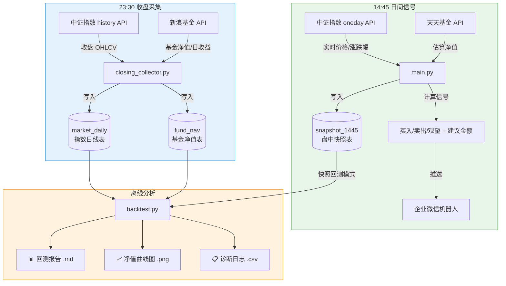
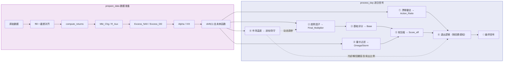

# TMT-Alpha 2.3 量化策略

> **当前版本**: V2.3 · 更新日期: 2026-05-30
> **推荐实盘版本**: 平衡版 V2.3
> **模型涉及基金**: 易方达信息产业混合C (019018)

---

## 🚀 命令速查表

### 日常运行

| 我要做什么 | 命令 | 什么时候用 |
|-----------|------|-----------|
| 拉取今日信号并推送 | `python main.py` | 每天 14:45（已配置定时任务则自动执行） |
| 拉取今日收盘数据 | `python scripts/closing_collector.py` | 每天 23:30（已配置定时任务则自动执行） |
| 跑一次全区间回测 | `python backtest.py` | 修改参数后验证效果 |
| 跑一次实盘起点回测 | `python backtest.py --live-start 2026-05-25` | 确认实盘从零开始的表现 |
| 跑三版本对比 | `python multi_version_backtest.py` | 对比保守/平衡/进取版差异 |

### 一次性维护

| 我要做什么 | 命令 | 什么时候用 |
|-----------|------|-----------|
| 首次初始化数据库 | `python db/data_pipeline.py init` | 第一次部署，拉取全量历史数据 |
| 手动增量更新数据 | `python db/data_pipeline.py update` | 数据缺失时手动补录 |
| 补录历史快照 | `python scripts/snapshot_collector.py --date 2026-05-25` | 某天 14:45 快照缺失 |
| 补录历史收盘 | `python scripts/closing_collector.py --date 2026-05-25` | 某天 23:30 收盘数据缺失 |
| 安装依赖 | `pip install requests pandas pyyaml matplotlib` | 新环境部署 |

---

## 📑 快速导航

| 章节 | 内容 |
|------|------|
| [⚠️ 重要声明](#️-重要声明) | 免责声明与风险提示 |
| [🏆 V2.3 核心业绩](#-v23-核心业绩) | 三版本对比、多起始点稳健性 |
| [V2.0 → V2.3 演进历程](#v20--v23-演进历程) | 13 项优化的时间线 |
| [一、架构总览](#一架构总览) | 系统架构图、数据流关系 |
| [二、信号计算管线](#二信号计算管线) | 八模块信号管线 |
| [三、V2.2 动态节奏优化](#三v22-动态节奏优化) | 进攻/防守参数对照 |
| [四、费率结构](#四费率结构) | 赎回费感知止盈 |
| [五、未来函数防御](#五未来函数防御) | 五重防线 |
| [六、成本价与止盈修复](#六成本价与止盈修复) | 历史修复记录 |
| [七、数据库](#七数据库) | ER 图、数据源 |
| [八、目录结构](#八目录结构) | 项目文件布局 |
| [九、快速开始](#九快速开始) | 部署步骤 |
| [十、定时任务](#十定时任务) | Windows / Linux 调度 |
| [十一、企业微信推送](#十一企业微信推送v23_notice_pro) | 五段式通知格式 |
| [十二、配置说明](#十二配置说明) | 关键配置项 |
| [十三、常见命令](#十三常见命令) | 命令参考 |
| [十四、常见问题](#十四常见问题) | FAQ |

---

## ⚠️ 重要声明

本模型仅为个人量化研究工具，不构成任何投资建议。

- 所有输出结果仅代表模型基于历史数据的数学计算，不保证未来收益，也不代表市场真实走势。
- 使用者需自行承担所有投资风险。作者不对因使用本模型产生的任何直接或间接损失负责。
- 模型依赖的因子可能会失效，回测结果不代表实际业绩。投资前请务必独立判断，并咨询专业持牌机构。
- 本仓库公开的代码、数据和说明仅用于交流学习，严禁用于商业用途或向他人提供付费投资建议。

---

## 🏆 V2.3 核心业绩

### 三版本对比（全区间 2023-10-19 ~ 2026-05-29）

| 指标 | 保守版 | **平衡版 V2.3** | 进取版 |
|------|--------|-----------------|--------|
| 累计收益率 | 241.8% | **286.20%** | 297.33% |
| 最大回撤 | -14.2% | **-17.41%** | -20.29% |
| 夏普比率 | 2.64 | **2.176** | 2.060 |
| 卡玛比率 | 17.0 | **16.437** | 14.652 |
| 基金 Beta | 0.922 | **0.922** | 0.922 |
| 买入次数 | 45 | 120 | 124 |
| 卖出次数 | 12 | 25 | 24 |

### 多起始点稳健性检验（8 个起始月）

| 统计 | 数值 |
|------|------|
| 超 TMT 胜率 | **88%**（7/8 跑赢） |
| 收益均值 | 181.0% |
| 收益中位数 | 183.2% |

> 📄 详细报告: [全区间回测报告](output/backtest_report.md) · [实盘起点报告](output/backtest_report_live_start.md) · [多版本对比](output/multi_version_comparison.md)

---

## V2.0 → V2.3 演进历程

### V2.0 — 基础架构升级

- **分段式防锯齿 P0-P3**：一刀切打折错失黄金坑 → 四级优先级分段系统 → 回撤 -15% 区域加倍买入
- **趋势感知止盈**：牛市频繁卖飞 → 动态抬高止盈阈值至 40%/70% → 卖出次数 27→20
- **市场温度自适应**：牛市现金拖累 → 进攻/防守模式动态调参 → 缩小与买入持有差距

### V2.1 — 费率与数据修复

- **赎回费感知止盈**：买 3 天就卖，手续费 1.5% → 有效阈值 = 基础阈值 + 赎回费率 → 避免白忙活交易
- **未来函数修复**：回测偷看收盘净值 → R_fund_live 覆盖为估算值 → 回测与实盘信号对齐
- **Beta 修复**：用策略收益算 Beta=0 → 改用 R_fund_actual → Beta 恢复为 0.922
- **成本价修复**：avg_cost 恒为 1.0 → 使用真实净值计算份额 → 止盈判断准确
- **双边摩擦 + 赎回费**：成本口径不对称 → 买卖对称 0.1% + 阶梯赎回费 → 费用透明

### V2.2 — 动态节奏优化

- **冷却期动态化**：牛市冷却 5 天太长 → 进攻 3 天 / 防守 5 天 → 牛市更快回补
- **移动止盈差异化**：防守模式容忍度过大 → 进攻 10% / 防守 8% → 防守更敏感
- **止盈比例动态化**：一刀切 33% → 进攻 20% / 防守 40% → 牛市少卖，熊市多锁
- **碎股过滤**：4-12 元无效买入 → 最低门槛 25 元 → 交易减少 12 笔，成本降 53%

### V2.3 — 防守参数回调

- **防守参数回调**：V2.2 防守过度敏感 → 移动止盈 6%→8%，冷却 7→5 天 → 收益回升，最佳平衡点

---

## 一、架构总览



> **数据隔离原则**：14:45 只写 `snapshot_1445`，23:30 只写 `market_daily` + `fund_nav`。两段时间窗口互不污染。

### 数据流关系

```
14:45 实盘信号                          23:30 收盘采集
┌─────────────────────┐                ┌─────────────────────┐
│ 中证 oneday API     │                │ 中证 history API    │
│ 天天基金 API        │                │ 新浪基金 API        │
└────────┬────────────┘                └────────┬────────────┘
         │                                      │
         ▼                                      ▼
   snapshot_1445                         market_daily + fund_nav
   (盘中快照)                            (收盘数据)
         │                                      │
         ├──── main.py 读取 ──→ 计算信号 ──→ 推送微信
         │
         └──── backtest.py 读取（快照回测模式）
                      ▲
                      │
              market_daily + fund_nav
              （全区间回测时作为主数据源）

三者关系：
- 14:45 快照是"实时决策用"，当天写入，当天用完
- 23:30 收盘是"历史积累用"，每天追加，供回测和指标计算
- 回测优先用快照（如果当天有的话），否则回退到收盘数据
```

---

## 二、信号计算管线



**八个模型模块**：

| 文件 | 职责 | 关键输出 |
|------|------|----------|
| `model1_benchmark.py` | 基准重构：Mkt_Chg、Excess_NAV、VIX | 法定主锚、超额指标 |
| `model2_drift_monitor.py` | 漂移雷达：分段式防锯齿 P0→P3 | Action_Ratio |
| `model3_trend_factor.py` | 趋势因子：MA60 乖离、Alpha 共振 | Final_Multiplier |
| `model4_base_scorer.py` | 基础评分 | Base 评分 |
| `model5_intraday_filter.py` | 量价过滤：波动率、收缩/极值/偏离 | Omega / Storm |
| `model6_soft_compressor.py` | 软压缩 + 四通道执行 A/B/C/D | Score_eff / Channel |
| `model7_exit_logic.py` | 退出逻辑：赎回费感知止盈 + 动态冷却 + 移动止盈 | sell_ratio |
| `model8_market_state.py` | 市场温度自适应：进攻/防守模式动态调参 | adaptive_params |

---

## 三、V2.2 动态节奏优化

V2.2/V2.3 的核心思想：根据市场温度（TMT 20 日涨幅）在进攻/防守模式间动态切换所有关键参数。

### 进攻/防守参数对照表

| 参数 | 进攻模式 | 防守模式 | 说明 |
|------|---------|---------|------|
| 止盈冷却期 | 3 天 | 5 天 | 进攻快速回补 |
| 移动止盈回撤容忍 | 10% | 8% | 进攻放宽容忍 |
| 一档止盈卖出比例 | 20% | 40% | 进攻少卖让仓位奔跑 |
| 二档止盈卖出比例 | 50% | 50% | 保持一致 |
| below_ma_power | 0.65 | 0.50 | 进攻放宽空头惩罚 |
| consecutive_drop_power | 0.35 | 0.25 | 进攻放宽连跌惩罚 |
| multiplier_min | 0.70 | 0.60 | 进攻放宽乘数下限 |
| max_position_ratio | 95% | 85% | 进攻提高仓位上限 |
| m_max_multiplier | 1.30 | 1.00 | 进攻放大买入上限 30% |

### 分段式防锯齿（model2）

| 优先级 | 触发条件 | Action_Ratio | 含义 |
|--------|---------|-------------|------|
| P0 | 基金单日跌幅 ≤ -2% | 0.70 | 单日暴跌，锁仓 |
| P1 | 20日超额回撤 ≤ -15% | 0.50 | 系统性风险，大幅缩量 |
| P2 | 20日超额回撤 ∈ (-15%, -10%] | **1.30** | 黄金坑，加倍买入 |
| P3 | 20日超额回撤 ∈ (-10%, -8%] | 0.80 | 常规防守，轻度打折 |

---

## 四、费率结构

| 费用类型 | 费率 | 说明 |
|---------|------|------|
| 买入申购费 | **0%** | 本基金真实费率 |
| 买入摩擦成本 | 0.1% | 回测模拟滑点 |
| 卖出摩擦成本 | 0.1% | 回测模拟滑点 |
| 卖出赎回费 | 0-6天 **1.5%** / 7-29天 **0.5%** / 30天+ **0%** | 真实基金规则 |

### 赎回费感知止盈

止盈有效阈值 = 基础阈值 + 当前赎回费率：

| 持有天数 | 赎回费 | 一档有效阈值 | 二档有效阈值 |
|---------|--------|------------|------------|
| 0-6 天 | 1.5% | 25% + 1.5% = **26.5%** | 50% + 1.5% = **51.5%** |
| 7-29 天 | 0.5% | 25% + 0.5% = **25.5%** | 50% + 0.5% = **50.5%** |
| 30 天+ | 0% | **25%** | **50%** |

> 设计意图：持有 3 天浮盈 3%，扣除 1.5% 赎回费后仅剩 1.5%，不值得卖出。等持有 30 天以上赎回费为 0 时再操作。

---

## 五、未来函数防御

本策略在 14:45 生成信号，基金净值当日约 20:00 后才公布。

### 五重防线

| 防线 | 机制 | 说明 |
|------|------|------|
| ① ffill 前向填充 | 仅用历史填当日空缺 | 禁止 bfill |
| ② 截断对齐 | 丢弃 fund_nav 数据开始前的行 | 确保首个净值有效 |
| ③ shift(1) 后移 | fund_nav、R_fund、Excess_DD 等 8 列后移 1 天 | t 时刻只看到 t-1 |
| ④ 结算隔离 | R_fund_actual / fund_nav_actual 保存真实值 | 仅用于基准和结算 |
| ⑤ 快照覆盖 | 有快照时用 fund_nav_estimated 推算 14:45 估算收益 | 替代收盘真实值 |

### 快照覆盖逻辑

当 `snapshot_1445` 中有当日数据时：
- `R_fund_live` = (估算净值 / 前一日净值 - 1) × 100%
- `Cum_Alpha_20d_live` 用估算 Alpha 重算
- 传入 model2，替代收盘后的真实值

> **结算隔离**：`R_fund_actual` / `fund_nav_actual` 仅用于持仓结算和基准计算，不参与信号决策。

---

## 六、成本价与止盈修复

### 买入成本价（已修复）

```
修复前: new_shares = buy_amount（把金额当份额），avg_cost 恒为 1.0
修复后: new_shares = buy_amount / fund_nav_actual，正确核算加权均价
```

### 双重止盈冲突（已修复）

所有 buy/sell/hold 决定权统一归 `model7_exit_logic.check_exit()`，`backtest.py` 仅负责执行。

---

## 七、数据库

```mermaid
erDiagram
    market_daily {
        TEXT trade_date PK
        TEXT index_code PK
        REAL close change_pct volume
    }
    fund_nav {
        TEXT trade_date PK
        REAL net_value daily_return
    }
    snapshot_1445 {
        TEXT trade_date PK
        REAL tmt_chg_pct fund_nav_estimated
        TEXT signal_action
        REAL signal_amount signal_score_eff
    }
```

| 表 | 数据源 | 采集时间 | 脚本 |
|----|--------|----------|------|
| `market_daily` | 中证指数 history API | 23:30 | `closing_collector.py` |
| `fund_nav` | 新浪基金 API | 23:30 | `closing_collector.py` |
| `snapshot_1445` | 中证 oneday + 天天基金 | 14:45 | `main.py` |

---

## 八、目录结构

```
├── config.yaml               # 配置（含 webhook，不入库）
├── main.py                   # 14:45 实盘信号入口
├── backtest.py               # 回测引擎（含稳健性检验）
├── multi_version_backtest.py # 多版本对比回测
├── core/
│   ├── config_loader.py      # 配置加载
│   ├── strategy.py           # 策略引擎
│   └── notifier.py           # 企业微信推送（v2.3_notice_pro）
├── model/
│   ├── model1_benchmark.py   # 基准重构
│   ├── model2_drift_monitor.py # 漂移雷达 + P0-P3 防锯齿
│   ├── model3_trend_factor.py  # 趋势因子
│   ├── model4_base_scorer.py   # 基础评分
│   ├── model5_intraday_filter.py # 量价过滤
│   ├── model6_soft_compressor.py # 软压缩 + 通道
│   ├── model7_exit_logic.py   # 赎回费感知止盈 + 动态节奏
│   └── model8_market_state.py # 市场温度自适应
├── db/
│   ├── data_pipeline.py      # SQLite 数据管道
│   └── tmt_alpha.db          # 运行时生成
├── scripts/
│   ├── closing_collector.py  # 23:30 收盘采集
│   └── snapshot_collector.py # 14:45 快照补录
└── output/                   # 回测输出
    ├── backtest_report.md
    ├── backtest_report_live_start.md
    ├── backtest_result.png
    ├── diagnostic_log.csv
    └── multi_version_comparison.md
```

---

## 九、快速开始

```bash
# 1. 安装依赖
pip install requests pandas pyyaml matplotlib

# 2. 配置
cp config.example.yaml config.yaml
# 编辑 config.yaml，设置 wechat.webhook_url

# 3. 初始化数据库
python db/data_pipeline.py init

# 4. 运行回测
python backtest.py                           # 全区间回测
python backtest.py --live-start 2026-05-25   # 实盘起点回测
python multi_version_backtest.py             # 多版本对比

# 5. 实盘信号
python main.py
```

---

## 十、定时任务

| 时间 | 脚本 | 做什么 |
|------|------|--------|
| 14:45 | `main.py` | 拉取实时指数 → 写快照 → 算信号 → 推微信 |
| 23:30 | `scripts/closing_collector.py` | 拉取收盘数据 + 基金净值 |

### Windows 任务计划程序

1. Win+R → `taskschd.msc`
2. 创建基本任务 → 触发器：每天 14:45
3. 操作：`python main.py`，起始于项目目录
4. 属性 → 条件 → 取消"只有在交流电源时才启动"

---

## 十一、企业微信推送（v2.3_notice_pro）

每天两条消息，五段式专业化信号通知：

### 14:45 信号通知（五段式）

```
一、市场环境
  市场温度 + 模式（进攻/防守）
  TMT 实时涨跌 + MA60 乖离率
  白话总结

二、核心信号
  法定主锚 Mkt_Chg（权重说明）
  四核辅助指标表格
  Score_eff 计算路径
  执行通道

三、风控与资金
  最终乘数 + 影响因子
  Action_Ratio + 触发原因
  碎股过滤说明

四、持仓与赎回费（有持仓时）
  持仓天数 + 累计收益率
  预估赎回费率
  止盈/止损水位

五、最终建议
  买入/卖出/观望 + 金额
  赎回费预估 或 仓位占比预估
```

### 23:30 收盘汇总

市场回顾 + 信号复盘 + 超额回撤风控评级。

---

## 十二、配置说明

关键配置项（完整见 `config.example.yaml`）：

| 配置路径 | 说明 |
|----------|------|
| `system.warmup_days` | 预热期天数（建议 60） |
| `exit_logic.tp_level_1` / `tp_level_2` | 基础止盈阈值 25% / 50% |
| `exit_logic.tp_level_1_strong` / `tp_level_2_strong` | 强趋势止盈 40% / 70% |
| `exit_logic.tp_sell_ratio_1` / `tp_sell_ratio_1_attack` | 防守 40% / 进攻 20% |
| `exit_logic.cool_down_days_attack` / `cool_down_days_defense` | 进攻 3 天 / 防守 5 天 |
| `exit_logic.trailing_stop_drawdown_attack` / `_defense` | 进攻 10% / 防守 8% |
| `market_state.attack_threshold` | 进攻触发阈值（TMT 20日涨幅 > 10%） |
| `execution.m_max_normal` / `m_min_normal` | 单笔上限 350 / 下限 25 |
| `backtest.use_snapshot` | 快照回测模式 |
| `wechat.webhook_url` | 企业微信 Webhook |

---

## 十三、常见命令

```bash
python backtest.py                           # 全区间回测
python backtest.py --live-start 2026-05-25   # 实盘起点回测
python multi_version_backtest.py             # 多版本对比
python main.py                               # 14:45 信号
python scripts/closing_collector.py          # 23:30 收盘采集
python db/data_pipeline.py init              # 初始化数据库
python db/data_pipeline.py update            # 增量更新
```

---

## 十四、常见问题

### 策略理解

**Q: 为什么全区间回测跑输买入持有？**
A: "买入持有"是事后诸葛亮策略——只有回头看才知道最佳买点。本策略从 2023-10-19 开始，恰好处于低点，买入持有收益率被起点运气严重拉高。多起始点检验显示，8 个起点中超 TMT 胜率 88%，证明策略本身有效。

**Q: 为什么多起始点胜率不是 100%？**
A: 这是策略真实性的证明。如果 100% 胜率，说明策略过拟合了。88% 胜率意味着在大多数市场环境下都能跑赢基准，但极端行情下可能短暂跑输，这是正常的。

**Q: 累计投入为什么远大于初始资金？**
A: 策略是"滚动投资"——买入后卖出，资金回笼再买入。全区间累计投入 ¥8,728 是所有买入金额之和，不是同时占用的资金。初始资金始终只有 ¥1,000。

**Q: 为什么不继续优化了？**
A: 过拟合风险。每次优化都在让策略更贴合历史数据，但实盘中市场会变化。V2.3 已经在收益（286%）和回撤（-17%）之间找到了最佳平衡点，继续优化可能只是在拟合噪声。下一步应该是实盘验证。

**Q: 回测和实盘结果一致吗？**
A: 回测支持快照模式（`use_snapshot: true`），用历史 14:45 盘中数据模拟信号，比收盘数据更贴近实盘。但实盘中还存在滑点、流动性等因素，会有微小差异。

### 实盘操作

**Q: 推送说买入 ¥89，但我实际该投多少？**
A: 推送金额基于回测初始资金 ¥1,000 计算。如果你的实际本金不同，按比例换算即可。例如本金 ¥10,000，就投 ¥890。模型不关心绝对金额，只关心仓位比例。

**Q: 仓位已经到 85% 了，推送还在说买入怎么办？**
A: 回测引擎会自动限制：当仓位达到 `max_position_ratio`（默认 85%）时，买入金额会被截断到剩余空间。如果截断后低于 25 元（最低门槛），就跳过不买。你看到的推送是"信号建议"，实际执行受仓位约束。

**Q: 今天的快照数据缺失（snapshot_1445 没有今天的记录）怎么办？**
A: 信号计算会自动回退到收盘数据（market_daily），精度略低但不影响大局。如果收盘数据也缺，说明定时任务没跑。手动补录：`python scripts/closing_collector.py --date 2026-05-25`。

**Q: 推送说"买入"，但我不确定今天该不该跟投？**
A: 模型只提供信号，不替你做决定。建议参考：
- Score_eff > 30 且 Action_Ratio = 1.0：信号较强，可以跟
- Score_eff < 25 或 Action_Ratio < 1.0：信号较弱或被打折，可以观望
- 持仓已接近 85%：即使信号是买入，也可以选择不加仓
- 市场处于防守模式且你已有较大浮盈：可以等回调再买

**Q: 怎么修改参数（比如单笔买入上限、止盈阈值）？**
A: 编辑 `config.yaml`，修改对应参数后重新运行回测验证效果。关键参数说明见[配置说明](#十二配置说明)章节。修改前建议先跑一次 `python backtest.py` 保存当前基线，改完再跑一次对比。

**Q: 推送失败怎么办？**
A: 推送失败不会中断程序。检查 `config.yaml` → `wechat.webhook_url`，确认 key 有效。

**Q: 数据库报 "table already exists"？**
A: 正常。`CREATE TABLE IF NOT EXISTS` 不会重复创建。
