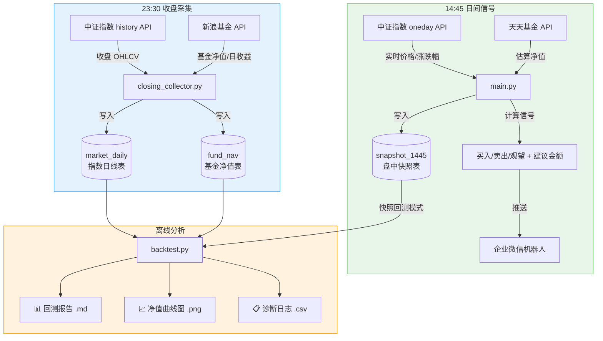
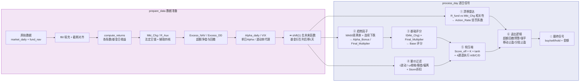
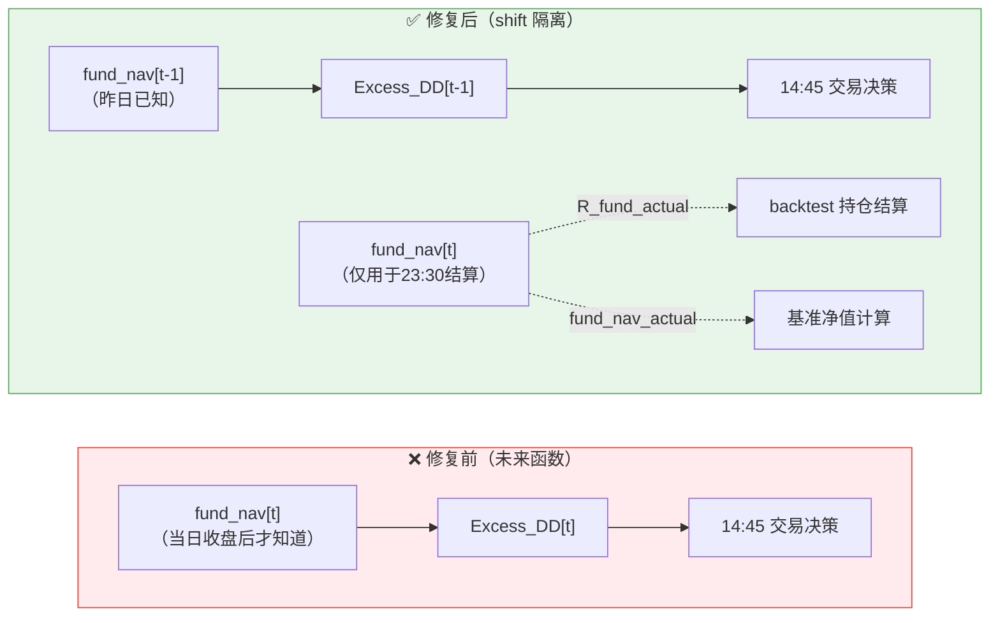
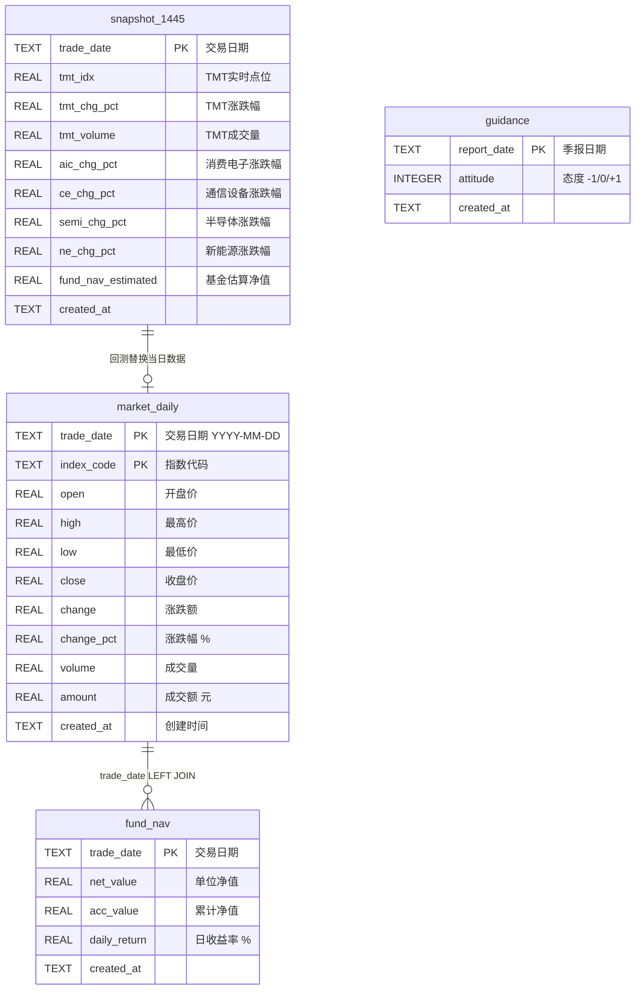

# TMT-Alpha 7.0 量化策略

易方达信息产业混合C (019018) 的量化信号系统与回测框架。

## 一、架构总览



> **数据隔离原则**：14:45 只写 `snapshot_1445`（盘中快照），23:30 只写 `market_daily` + `fund_nav`（收盘数据）。两段时间窗口互不污染。

---

## 二、信号计算管线



**七个模型模块**对应 `model/` 目录：

| 文件 | 职责 | 关键输出 |
|------|------|----------|
| `model1_benchmark.py` | 基准重构：Mkt_Chg、R_Aux、Excess_NAV、Excess_DD、VIX | 法定主锚、超额指标 |
| `model2_drift_monitor.py` | 漂移雷达：相关性监控、MAE、绝对亏损陷阱 | Action_Ratio |
| `model3_trend_factor.py` | 趋势因子：MA60乖离、连续下跌惩罚、Alpha共振 | Final_Multiplier |
| `model4_base_scorer.py` | 基础评分：f(x) 非线性映射 | Base 评分 |
| `model5_intraday_filter.py` | 量价过滤：波动率折扣、收缩/极值/偏离补偿 | Omega / Storm / τ |
| `model6_soft_compressor.py` | 软压缩与执行通道：K·tanh + 四通道分流 | Score_eff / Channel |
| `model7_exit_logic.py` | 退出逻辑：超额回撤预警/强平 + 移动止盈 | warning / force_reduce |

---

## 三、未来函数防御

本策略在 14:45 生成信号，而基金净值当日约 20:00 后才公布。直接从 `fund_nav[t]` 计算 `Excess_DD[t]` 并用于当日决策，会引入"偷窥未来"的严重偏差。



**三重防线**（全部实现在 `strategy.py:prepare_data`）：

| 防线 | 机制 | 说明 |
|------|------|------|
| ① ffill 前向填充 | 仅用历史填当日空缺 | 禁止 bfill，防止未来信息泄露 |
| ② 截断对齐 | 丢弃 fund_nav 数据开始前的行 | 确保首个净值为有效值 |
| ③ shift(1) 后移 | `fund_nav`、`R_fund`、`Excess_DD` 等 8 列整体后移 1 天 | t 时刻只看到 t-1 的基金数据 |
| 结算隔离 | `R_fund_actual` / `fund_nav_actual` 保存真实值 | 基准计算和持仓结算用真实数据，信号用滞后数据 |

---

## 四、成本价与止盈修复

### 买入成本价计算（已修复）

**修复前**：`backtest.py` 买入时 `new_shares = buy_amount`，将金额（元）直接当份额用，导致 `avg_cost_per_share` 恒为 1.0。

```
买入 100 元，基金净值 2.5 元
修复前: new_shares = 100, avg_cost = (0+100)/(0+100) = 1.0  ← 错！
修复后: new_shares = 100/2.5 = 40, avg_cost = (0+100)/(0+40) = 2.5 ← 对
```

**影响**：在旧版中 `avg_cost`=1.0 被传入移动止盈，与真实净值（如 2.5）对比时算出 150% 浮盈，稍有回撤就误触发清仓。

**修复方式**：买入时读取 `fund_nav_actual`（当日真实净值），`new_shares = buy_amount / fund_nav_actual`，正确核算加权均价。

### 双重止盈冲突（已修复）

**修复前**：`backtest.py` 和 `model7_exit_logic.py` 各自维护一套止盈逻辑，同时运行导致"双核抢方向盘"，仓位被两边同时砍。

**修复后**：`backtest.py` 中写死的分批止盈代码块（~40行）全部删除，所有 buy/sell/hold 决定权统一归 `model7_exit_logic.check_exit()`，`backtest.py` 仅负责执行和记账。

| 决策权 | 修复前 | 修复后 |
|--------|--------|--------|
| 止盈触发 | backtest.py + model7 双重 | 仅 model7 |
| 建仓/减仓 | strategy + backtest 混合 | strategy 统一产出 signal |
| 成本价计算 | `avg_cost` 恒 1.0 | `fund_nav_actual` 真实净值 |
| 接口 | `avg_cost`（成本价） | `current_gain`（真实收益率） |

### 定投金额对齐

定投基准的总投入现在与策略初始资金对齐：`dca_amount = initial_capital / 回测月份数`，确保可比口径一致。

---

## 五、数据库 ER 图



**数据来源**：

| 表 | 数据源 | 采集时间 | 采集脚本 |
|----|--------|----------|----------|
| `market_daily` | 中证指数 history API | 23:30 | `closing_collector.py` |
| `fund_nav` | 新浪基金 netWorth API | 23:30 | `closing_collector.py` |
| `snapshot_1445` | 中证指数 oneday API + 天天基金 | 14:45 | `main.py` |
| `guidance` | 季报人工录入 | 按需 | 手动 SQL |

---

## 六、目录结构

```
├── config.yaml               # 本地配置（含 webhook，不入库）
├── config.example.yaml       # 配置模板（可入库）
├── main.py                   # 14:45 实盘信号入口
├── backtest.py               # 回测引擎：逐日模拟 + 绩效指标 + 图表
├── robustness_check.py       # 多起始月稳健性检验
├── core/                     # 核心业务层
│   ├── config_loader.py      #   配置加载 + 默认值合并
│   ├── strategy.py           #   策略引擎：prepare_data + process_day
│   └── notifier.py           #   企业微信 Markdown 推送
├── model/                    # 7 个策略子模块
│   ├── model1_benchmark.py   #   基准重构
│   ├── model2_drift_monitor.py # 漂移雷达
│   ├── model3_trend_factor.py  # 趋势因子
│   ├── model4_base_scorer.py   # 基础评分
│   ├── model5_intraday_filter.py # 量价过滤
│   ├── model6_soft_compressor.py # 软压缩+通道
│   └── model7_exit_logic.py   # 退出逻辑
├── db/
│   ├── data_pipeline.py      # SQLite 建表 / API拉取 / 数据加载
│   └── tmt_alpha.db          # 运行时生成
├── scripts/
│   ├── closing_collector.py  # 23:30 收盘数据采集
│   ├── snapshot_collector.py # 14:45 快照手动补录
│   └── migrate_date_format.py # 日期格式迁移 YYYYMMDD→YYYY-MM-DD
└── output/                   # 回测输出（不入库）
    ├── backtest_report.md    #   回测报告
    ├── backtest_result.png   #   净值曲线图
    ├── diagnostic_log.csv    #   逐日诊断日志
    └── robustness_summary.csv #  稳健性汇总
```

---

## 七、快速开始

### 1. 安装依赖

```bash
pip install requests pandas pyyaml matplotlib
```

### 2. 配置文件

```bash
# Windows
copy config.example.yaml config.yaml
# Mac / Linux
cp config.example.yaml config.yaml
```

编辑 `config.yaml`，至少设置 `wechat.webhook_url`。

> `config.yaml` 含 webhook 密钥，已在 `.gitignore` 中排除。

### 3. 初始化数据库

```bash
python db/data_pipeline.py init
```

拉取 5 个指数近一年历史 + 基金近两年净值，约需 10-20 秒。

### 4. 运行回测

```bash
python backtest.py
```

输出在 `output/`：回测报告 `.md`、净值曲线 `.png`、诊断日志 `.csv`。

### 5. 运行实盘信号

```bash
python main.py
```

---

## 八、任务与调度

项目需要两个定时任务：

| 时间 | 脚本 | 做什么 | 写哪些表 |
|------|------|--------|----------|
| 14:45 | `main.py` | 拉取实时指数 → 写快照 → 算信号 → 推微信 | `snapshot_1445` |
| 23:30 | `scripts/closing_collector.py` | 拉取收盘 OHLCV → 拉取基金净值 | `market_daily` + `fund_nav` |

```mermaid
gantt
    title 每日数据流时间线
    dateFormat HH:mm
    axisFormat %H:%M

    section 14:45日间
    拉取实时指数      :t1, 14:45, 10m
    写入snapshot_1445 :t2, after t1, 1m
    计算策略信号      :t3, after t2, 1m
    企业微信推送      :t4, after t3, 1m

    section 市场时间
    A股收盘15:00      :milestone, 15:00, 0m
    基金净值公布~20:00 :milestone, 20:00, 0m

    section 23:30收盘
    拉取收盘数据      :t5, 23:30, 10m
    写入market_daily  :t6, after t5, 2m
    拉取基金净值      :t7, after t6, 5m
    写入fund_nav      :t8, after t7, 1m
    计算收盘汇总      :t9, after t8, 2m
    推送汇总到微信    :t10, after t9, 1m
```



### 推送通知一览

每天会收到两条企业微信消息：

| 时间 | 内容 | 来源 |
|------|------|------|
| 14:45 | **信号通知**：操作建议、执行通道、超额回撤 | `main.py` |
| 23:30 | **收盘汇总**：今日市场、信号复盘、更新后风险指标 | `closing_collector.py` |

### Windows 任务计划程序

**任务一：14:45 日间信号**

1. 打开"任务计划程序"（Win+R → `taskschd.msc`）
2. 创建基本任务 → 名称 `TMT-Alpha 日间信号`
3. 触发器：`每天`，`14:45`
4. 操作：启动程序
   - 程序：`python`（或用完整路径如 `C:\Users\用户名\AppData\Local\Programs\Python\Python312\python.exe`）
   - 参数：`main.py`
   - 起始于：`D:\项目\基金相关\易方达信息产业混合C`
5. 属性 → 条件 → 取消"只有在计算机使用交流电源时才启动"

**任务二：23:30 收盘采集**

同上，参数改为 `scripts/closing_collector.py`，时间 `23:30`。

### Linux cron

```bash
crontab -e
```

```cron
45 14 * * 1-5 cd /path/to/project && python main.py >> logs/main.log 2>&1
30 23 * * 1-5 cd /path/to/project && python scripts/closing_collector.py >> logs/closing.log 2>&1
```

> `1-5` = 周一至周五。如遇调休补班可临时加一条 `*` 的。

---

## 九、配置说明

关键配置项（完整见 `config.example.yaml`）：

| 配置路径 | 类型 | 说明 |
|----------|------|------|
| `system.warmup_days` | int | 预热期天数，0=立即开始交易，60=跳过前60天信号 |
| `benchmark.equity_weight` | float | 法定主锚权益权重，默认 0.70 |
| `benchmark.deposit_daily_rate` | float | 现金日利率 |
| `drift_monitor.corr_threshold` | float | 漂移关联系数阈值 |
| `trend_filter.ma_period` | int | 趋势均线周期，默认 60 |
| `volume_control.storm_discount_value` | float | 风暴折扣值 |
| `exit_logic.excess_dd_warning_base` | float | 超额回撤预警线，默认 -0.10 |
| `exit_logic.excess_dd_force_base` | float | 超额回撤强平线，默认 -0.15 |
| `exit_logic.trailing_stop_activate` | float | 移动止盈激活阈值 |
| `exit_logic.trailing_stop_drawdown` | float | 移动止盈回撤触发 |
| `execution.m_max_normal` | int | 单笔买入上限 |
| `backtest.initial_capital` | int | 回测初始资金 |
| `backtest.use_snapshot` | bool | 是否使用 14:45 快照回测 |
| `wechat.webhook_url` | string | 企业微信机器人 Webhook |
| `schedule.daily_signal_time` | string | 信号时间（仅文档用途） |

---

## 十、企业微信推送

每天两条消息，每条指标都附带白话解释，覆盖决策→复盘完整链路。

### 14:45 信号通知

`main.py` → `send_signal_notification()` → 交易建议 + 风控状态：

```
## TMT-Alpha 7.0 每日信号
日期: 2026-03-24

| 指标 | 数值 | 白话解释 |
| Mkt_Chg (主锚涨跌幅) | +1.23% | 基准今天表现，正数=大盘在涨 |
| Score_eff (有效得分) | 35.2 | 信号强弱，越高越倾向买入 |
| Action_Ratio (惩罚系数) | 0.90 | 风控打折，<1 说明模型在主动降仓位 |
| Final_Multiplier (综合乘数) | 0.93 | 趋势加成，>1 顺势加码，<1 逆势减码 |
| Excess_DD (超额回撤) | -3.50% | 基金跑输基准的幅度，越负越危险 |

执行通道: 🟢A
> 积极进攻，信号强、风控绿灯

建议操作: 🟢 买入
建议金额: ¥168
```

### 23:30 收盘汇总

`closing_collector.py` → `send_closing_summary()` → 市场回顾 + 信号复盘 + 风控评级：

```
## TMT-Alpha 7.0 收盘汇总
日期: 2026-03-24

今日市场
| 指标 | 数值 | 白话解释 |
| TMT 收盘涨跌幅 | +1.45% | 基准指数全天实际涨跌 |
| TMT 盘中 (14:45) | +1.23% | 发信号时的盘中涨跌 |
| 尾盘变动 | +0.22% 窄幅震荡 | 14:45→收盘的差值 |
| 基金日收益 | +1.30% | 基金今天实际涨了/跌了多少 |
| 单日超额 | -0.08% | 基金vs基准，正数=今天跑赢了 |
| 超额回撤 (更新后) | -3.20% | 累计跑输幅度，已包含今日 |

> 🟡 注意区，超额回撤有所扩大

今日信号回顾 (14:45)
| 操作建议 | 🟢 买入 | 模型认为今天是加仓时机 |
| 执行通道 | 🟢A | A积极→D防守 |
| 建议金额 | ¥168 | 模型建议的操作金额 |

数据采集: ✅ 正常
```

### 超额回撤风控分级

收盘汇总中会根据 Excess_DD 自动标注风险等级：

| 区间 | 等级 | 含义 |
|------|------|------|
| > -2% | 🟢 安全区 | 基金跑赢或微幅跑输 |
| -2% ~ -5% | 🟡 注意区 | 超额回撤有所扩大 |
| -5% ~ -10% | 🟠 警戒区 | 接近预警线，密切关注 |
| < -10% | 🔴 危险区 | 已触发/接近风控线 |

> `closing_collector.py --no-notify` 可跳过收盘推送（仅采集数据）。

### 配置

`notifier.py` 读取 `config.yaml` → `wechat.webhook_url`。推送失败不会中断脚本。

---

## 十一、常见命令

```bash
# 数据库
python db/data_pipeline.py init          # 首次建库 + 拉历史
python db/data_pipeline.py update        # 手动增量更新（通常由定时任务调用）
python db/data_pipeline.py load          # 加载数据并校验

# 回测
python backtest.py                       # 完整回测
python robustness_check.py               # 多起始月稳健性检验

# 实盘
python main.py                           # 14:45 日间信号

# 快照
python scripts/snapshot_collector.py                     # 手动采集当日快照
python scripts/snapshot_collector.py --date 2026-03-24   # 补录历史快照

# 收盘
python scripts/closing_collector.py                      # 手动采集当日收盘
python scripts/closing_collector.py --date 2026-03-24    # 补录历史收盘

# 工具
python scripts/migrate_date_format.py     # 日期格式迁移（YYYYMMDD→YYYY-MM-DD）
```

---

## 十二、常见问题

**Q: 为什么信号时间是 14:45？**
A: 接近收盘但早于 15:00 截止，涨跌幅参考价值高且留有决策执行时间。同时需要等 fund_nav 于 20 点后公布，因此不能更晚。

**Q: 回测和实盘结果一致吗？**
A: 回测支持快照模式（`backtest.use_snapshot: true`），用历史上的 14:45 盘中数据模拟信号，比用收盘数据做回测更贴近实盘。

**Q: 推送失败怎么办？**
A: 推送失败不会中断程序。检查 `config.yaml` → `wechat.webhook_url`，确认 key 有效。

**Q: 定时任务没触发？**
A: Windows → 任务计划程序 → 历史记录；Linux → `grep CRON /var/log/syslog`。确认 Python 路径和项目路径正确。

**Q: 数据库报 "table already exists"？**
A: 正常。所有建表语句都是 `CREATE TABLE IF NOT EXISTS`，不会重复创建。

**Q: 移动/重命名文件夹后回测收益大幅下降？**
最常见的原因是 `core/config_loader.py` 中的 `CONFIG_PATH` 失效。
`config_loader.py` 使用 `Path(__file__).parent.parent / "config.yaml"` 定位根目录的配置文件。
当你把 `config_loader.py` 移动到 `core/` 后，路径层级改变：`Path(__file__).parent` 变成了 `core/` 而非项目根目录。
后果是找不到 `config.yaml`，回退到代码内硬编码的默认参数。关键差异是默认 `warmup_days=60`（跳过前60天信号），而 `config.yaml` 中为 `0`（立即开始交易），导致回测丢失约 3 个月的交易机会。
**排查方法**：运行 `python -c "from core.config_loader import load_config; print(load_config()['system']['warmup_days'])"` — 如果输出 `60` 而非 `0`，说明配置文件未被正确加载。
