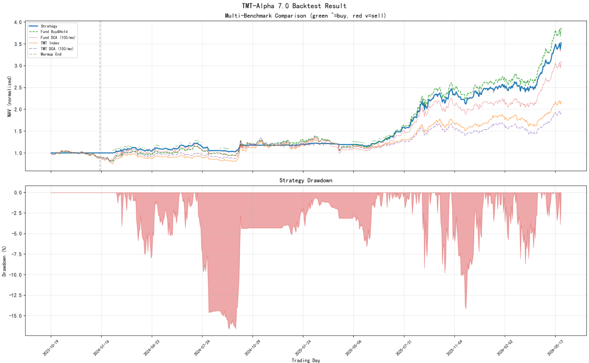
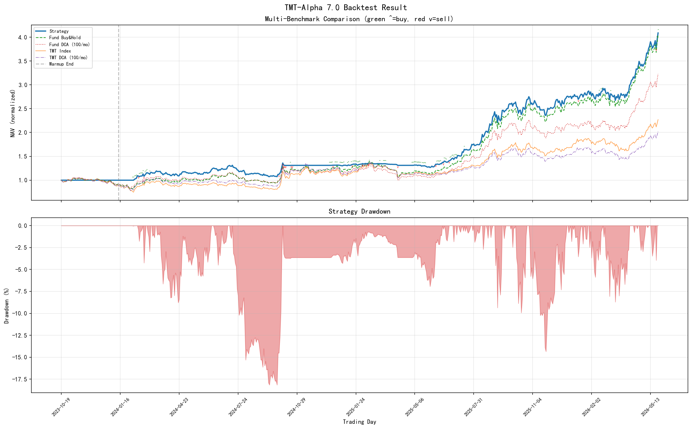
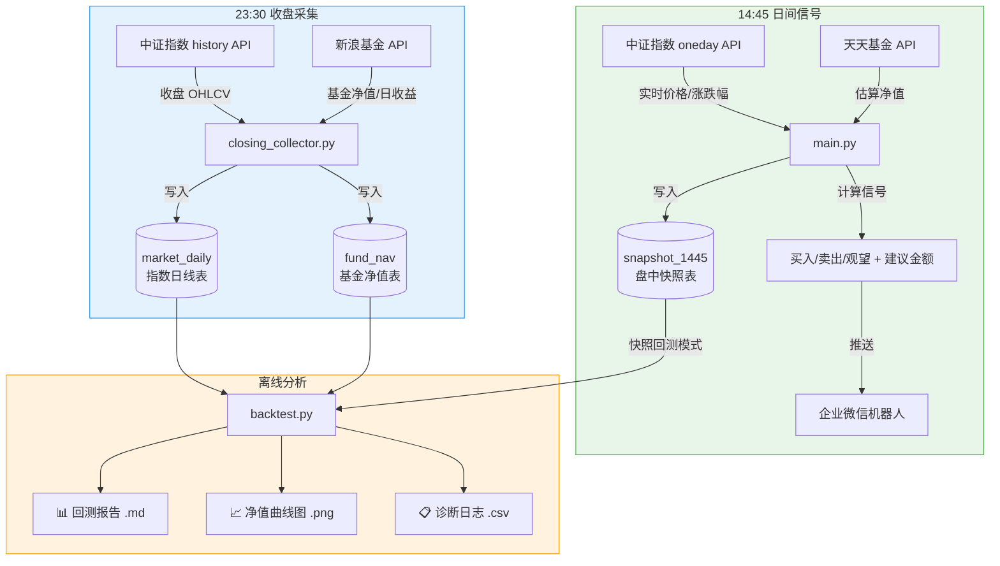
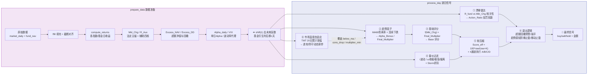
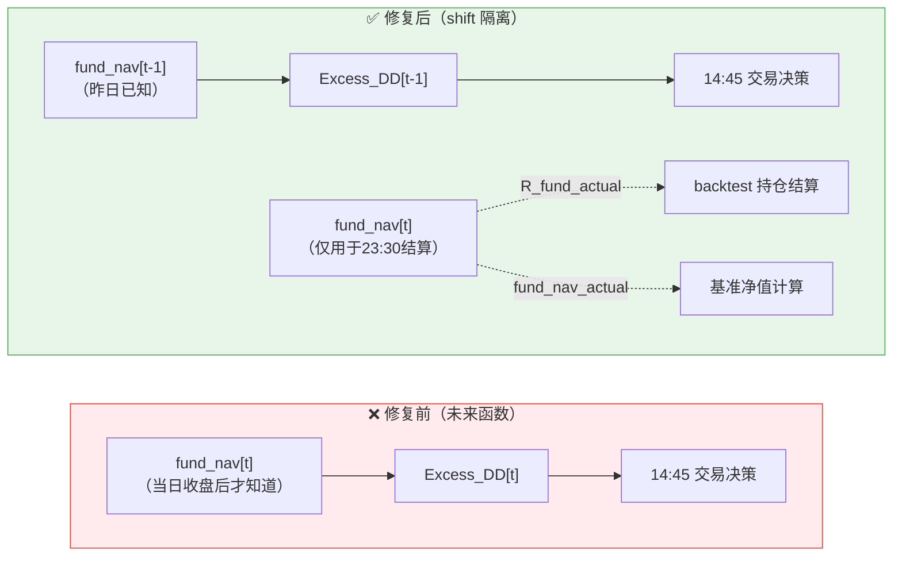
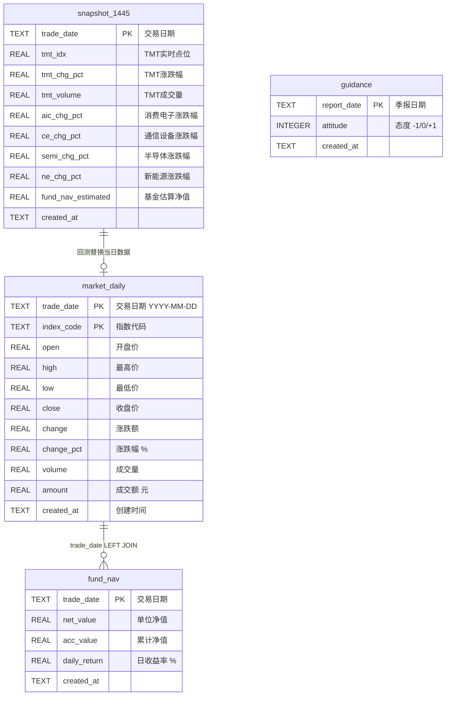

# TMT-Alpha 2.0 量化策略

易方达信息产业混合C (019018) 的量化信号系统与回测框架。
## ⚠️ 重要声明

本模型仅为个人量化研究工具，不构成任何投资建议。

- 所有输出结果（包括 SBI 分数、建议买入金额）仅代表模型基于历史数据的数学计算，不保证未来收益，也不代表市场真实走势。
- 使用者需自行承担所有投资风险。作者不对因使用本模型产生的任何直接或间接损失负责。
- 模型依赖的因子可能会失效，回测结果不代表实际业绩。投资前请务必独立判断，并咨询专业持牌机构。
- 本仓库公开的代码、数据和说明仅用于交流学习，严禁用于商业用途或向他人提供付费投资建议。

---

## 🏆 核心业绩展示与进化历程 (v1.0 vs v2.0)

> **导读**：TMT-Alpha 策略从基础的 1.0 版本进化至当前的 2.0 版本（平衡pro版），在维持回撤基本不变的前提下，通过对抄底逻辑、趋势感知止盈和资金利用率的深度优化，实现了收益和夏普比率的飞跃。

### 1. 核心指标矩阵对比

| 绩效指标 | TMT-Alpha 1.0 (平衡版) | TMT-Alpha 2.0 (平衡Pro版) | **进化表现** |
|----------|------------------------|---------------------------|----------------|
| **累计收益率** | **266.77%** | **308.81%** | 📈 **暴增 +42.04%** |
| **最大回撤** | -16.88% | **-18.15%** | 🛡️ **仅扩大 1.27% (风控稳定)** |
| **夏普比率** | 2.179 | **2.232** | 💎 **性价比更优** |
| **卡玛比率** | 15.808 | **17.010** | 🚀 **收益回撤比更高** |
| vs 买入持有超额 | -79.84% | **-37.81%** | 🐅 **牛市追击，大幅缩窄差距** |
| vs 基金定投超额 | 10.37% | **52.40%** | 💰 **显著跑赢懒人投资** |
| **买入次数** | 119 | **81** | 🎯 **抄底更精准，少动多赚** |
| **卖出次数** | 27 | **20** | 牢牢锁住主升浪，拒绝卖飞 |

### 2. 净值曲线直观对比

<table style="width: 100%; text-align: center; border-collapse: collapse;">
  <tr>
    <th style="width: 50%;"><b>TMT-Alpha 1.0 (优化前)</b></th>
    <th style="width: 50%;"><b>TMT-Alpha 2.0 (优化后)</b></th>
  }
  <tr>
    <td></td>
    <td></td>
  }
</table>

### 3. 进化总结

1.  **解决了“牛市资金拖累（Cash Drag）”**：2.0 版本通过“市场自适应（进攻模式）”在牛市动态放宽仓位上限和买入额度，解决了 1.0 版本因为太守规矩导致大量现金闲置、严重跑输满仓基准的问题。
2.  **解决了”黄金坑抄底不足”**：1.0 只是僵化地”跌了打折防锯齿”；2.0 引入非线性”分段式抄底”（P0 单日暴跌 → P1 系统性风险 0.5x → P2 黄金坑 1.3x 加倍 → P3 常规防守 0.8x），在回撤跌透至高弹性区间（如 -10%）时敢于重拳出击，吃到了超额Alpha。
3.  **解决了“牛市频繁卖飞”**：2.0 将固定一刀切止盈升级为“趋势感知阶梯止盈”，强趋势中动态抬高目标位，大幅减少了卖出次数（27→20），将每一次止盈都做到了极致性价比。

📄 **深度测评报告**：[点击查看 多版本对比回测报告 (含熊市压力测试与多起点稳健性检验)](output/multi_version_comparison.md)
## 一、架构总览



> **数据隔离原则**：14:45 只写 `snapshot_1445`（盘中快照），23:30 只写 `market_daily` + `fund_nav`（收盘数据）。两段时间窗口互不污染。

---

## 二、信号计算管线



**八个模型模块**对应 `model/` 目录：

| 文件 | 职责 | 关键输出 |
|------|------|----------|
| `model1_benchmark.py` | 基准重构：Mkt_Chg、R_Aux、Excess_NAV、Excess_DD、VIX | 法定主锚、超额指标 |
| `model2_drift_monitor.py` | 漂移雷达：相关性监控、MAE、分段式防锯齿（P0→P3 四级） | Action_Ratio |
| `model3_trend_factor.py` | 趋势因子：MA60乖离、below_ma 空头惩罚、连续下跌惩罚、Alpha共振 | Final_Multiplier |
| `model4_base_scorer.py` | 基础评分：f(x) 非线性映射 | Base 评分 |
| `model5_intraday_filter.py` | 量价过滤：波动率折扣、收缩/极值/偏离补偿 | Omega / Storm / τ |
| `model6_soft_compressor.py` | 软压缩与执行通道：K·tanh + 四通道分流 | Score_eff / Channel |
| `model7_exit_logic.py` | 退出逻辑：超额回撤预警/强平 + 趋势感知阶梯止盈 + 移动止盈 + 时间止损 | warning / force_reduce |
| `model8_market_state.py` | 市场温度自适应：TMT 20日涨幅 → 进攻/防守模式动态调参 | adaptive_params |

### 分段式防锯齿（model2，v2.0 核心升级）

v1.0 的绝对亏损防锯齿是"一刀切"逻辑（触发则统一打折），v2.0 升级为四级优先级分段系统，根据回撤深度差异化应对：

| 优先级 | 触发条件 | Action_Ratio | 含义 |
|--------|---------|-------------|------|
| **P0** | 基金单日跌幅 ≤ -2%（绝对值） | 0.70 | 单日暴跌，最高优先级，触发即锁仓 |
| **P1** | 20日超额回撤 ≤ -15% | 0.50 | 系统性风险，重防守，大幅缩量 |
| **P2** | 20日超额回撤 ∈ (-15%, -10%] | **1.30** | 黄金坑反弹区，加倍买入吃超额Alpha |
| **P3** | 20日超额回撤 ∈ (-10%, -8%] | 0.80 | 常规防守，轻度打折控制风险 |

> **设计意图**：v1.0 在回撤 -10% 时仍在打折，错失黄金坑反弹。v2.0 在跌透到高弹性区间时反向加倍（1.3x），实现"别人恐惧我贪婪"的量化表达。P0 优先级最高，可以覆盖所有下级逻辑。

---

## 三、趋势感知止盈与市场自适应

### 趋势感知阶梯止盈（model7）

不同于固定阈值止盈，当前版本根据市场趋势动态调整止盈线：

| 条件 | 一档止盈 | 二档止盈 | 冷却期 |
|------|---------|---------|--------|
| 弱趋势 / 过渡期 | 25%（固定） | 50%（固定） | 5 天 |
| **强趋势** | **min(40%, 浮盈峰值×0.80)** | **min(70%, 浮盈峰值×0.90)** | 5 天 |

**强趋势判断**（满足任一即可）：
- 基金净值 > MA40，且近 5 日收益率 > 1%
- 基金净值偏离 MA40 > 5%（兜底匀速慢涨行情）

趋势转弱（跌破 MA40 或 5 日收益 < 0）时自动恢复原固定阈值。

### 市场温度自适应（model8）

根据 TMT 指数过去 20 个交易日累计涨幅，动态调整核心参数：

| 模式 | 触发条件 | below_ma_power | consecutive_drop_power | multiplier_min | m_max_multiplier | max_position_ratio |
|------|---------|---------------|----------------------|----------------|-----------------|-------------------|
| 🟢 进攻 | TMT 20日涨幅 > 10% | 0.65 | 0.35 | 0.70 | 1.30 | 0.95 |
| 🔵 防守 | TMT 20日涨幅 ≤ 10% | 0.50 | 0.25 | 0.60 | 1.00 | 0.85 |

**v2.0 新增**：进攻模式下 `m_max_multiplier=1.30` 将单笔买入上限放大 30%，`max_position_ratio=0.95` 将仓位上限从 85% 提升至 95%，彻底解决牛市中"有钱没处花"的 Cash Drag 问题。

设计意图：牛市中回调不缩手，敢于加仓缩小与买入持有的差距；熊市中恢复保守参数控制回撤。

### 诊断日志

每日 `diagnostic_log.csv` 输出 `market_temp`（市场温度值）、`market_mode`（attack/defense）、`trend_strong`（True/False），可验证两个模块的切换频率。

---

## 四、未来函数防御

本策略在 14:45 生成信号，而基金净值当日约 20:00 后才公布。直接从 `fund_nav[t]` 计算 `Excess_DD[t]` 并用于当日决策，会引入"偷窥未来"的严重偏差。



**三重防线**（全部实现在 `strategy.py:prepare_data`）：

| 防线 | 机制 | 说明 |
|------|------|------|
| ① ffill 前向填充 | 仅用历史填当日空缺 | 禁止 bfill，防止未来信息泄露 |
| ② 截断对齐 | 丢弃 fund_nav 数据开始前的行 | 确保首个净值为有效值 |
| ③ shift(1) 后移 | `fund_nav`、`R_fund`、`Excess_DD` 等 8 列整体后移 1 天 | t 时刻只看到 t-1 的基金数据 |
| 结算隔离 | `R_fund_actual` / `fund_nav_actual` 保存真实值 | 基准计算和持仓结算用真实数据，信号用滞后数据 |

---

## 五、成本价与止盈修复

### 买入成本价计算（已修复）

**修复前**：`backtest.py` 买入时 `new_shares = buy_amount`，将金额（元）直接当份额用，导致 `avg_cost_per_share` 恒为 1.0。

```
买入 100 元，基金净值 2.5 元
修复前: new_shares = 100, avg_cost = (0+100)/(0+100) = 1.0  ← 错！
修复后: new_shares = 100/2.5 = 40, avg_cost = (0+100)/(0+40) = 2.5 ← 对
```

**影响**：在旧版中 `avg_cost`=1.0 被传入移动止盈，与真实净值（如 2.5）对比时算出 150% 浮盈，稍有回撤就误触发清仓。

**修复方式**：买入时读取 `fund_nav_actual`（当日真实净值），`new_shares = buy_amount / fund_nav_actual`，正确核算加权均价。

### 双重止盈冲突（已修复）

**修复前**：`backtest.py` 和 `model7_exit_logic.py` 各自维护一套止盈逻辑，同时运行导致"双核抢方向盘"，仓位被两边同时砍。

**修复后**：`backtest.py` 中写死的分批止盈代码块（~40行）全部删除，所有 buy/sell/hold 决定权统一归 `model7_exit_logic.check_exit()`，`backtest.py` 仅负责执行和记账。

| 决策权 | 修复前 | 修复后 |
|--------|--------|--------|
| 止盈触发 | backtest.py + model7 双重 | 仅 model7 |
| 建仓/减仓 | strategy + backtest 混合 | strategy 统一产出 signal |
| 成本价计算 | `avg_cost` 恒 1.0 | `fund_nav_actual` 真实净值 |
| 接口 | `avg_cost`（成本价） | `current_gain`（真实收益率） |

### 定投金额对齐

定投基准的总投入现在与策略初始资金对齐：`dca_amount = initial_capital / 回测月份数`，确保可比口径一致。

---

## 六、数据库 ER 图



**数据来源**：

| 表 | 数据源 | 采集时间 | 采集脚本 |
|----|--------|----------|----------|
| `market_daily` | 中证指数 history API | 23:30 | `closing_collector.py` |
| `fund_nav` | 新浪基金 netWorth API | 23:30 | `closing_collector.py` |
| `snapshot_1445` | 中证指数 oneday API + 天天基金 | 14:45 | `main.py` |
| `guidance` | 季报人工录入 | 按需 | 手动 SQL |

---

## 七、目录结构

```
├── config.yaml               # 本地配置（含 webhook，不入库）
├── config.example.yaml       # 配置模板（可入库）
├── main.py                   # 14:45 实盘信号入口
├── backtest.py               # 回测引擎：逐日模拟 + 绩效指标 + 图表（含内联稳健性检验）
├── multi_version_backtest.py # 多版本对比回测（保守/平衡/进取 × 多区间 × 稳健性）
├── robustness_check.py       # 多起始月稳健性检验（旧版，被 multi_version_backtest.py 取代）
├── core/                     # 核心业务层
│   ├── config_loader.py      #   配置加载 + 默认值合并
│   ├── strategy.py           #   策略引擎：prepare_data + process_day
│   └── notifier.py           #   企业微信 Markdown 推送
├── model/                    # 8 个策略子模块
│   ├── model1_benchmark.py   #   基准重构
│   ├── model2_drift_monitor.py # 漂移雷达
│   ├── model3_trend_factor.py  # 趋势因子
│   ├── model4_base_scorer.py   # 基础评分
│   ├── model5_intraday_filter.py # 量价过滤
│   ├── model6_soft_compressor.py # 软压缩+通道
│   ├── model7_exit_logic.py   # 退出逻辑
│   └── model8_market_state.py # 市场温度自适应
├── db/
│   ├── data_pipeline.py      # SQLite 建表 / API拉取 / 数据加载
│   └── tmt_alpha.db          # 运行时生成
├── scripts/
│   ├── closing_collector.py  # 23:30 收盘数据采集
│   ├── snapshot_collector.py # 14:45 快照手动补录
│   └── migrate_date_format.py # 日期格式迁移 YYYYMMDD→YYYY-MM-DD
└── output/                   # 回测输出（不入库）
    ├── backtest_report.md    #   回测报告
    ├── backtest_result.png   #   净值曲线图
    ├── diagnostic_log.csv    #   逐日诊断日志（含市场温度/趋势状态）
    ├── robustness_summary.csv #  稳健性汇总（旧版）
    └── multi_version_comparison.md # 多版本对比报告
```

---

## 八、快速开始

### 1. 安装依赖

```bash
pip install requests pandas pyyaml matplotlib
```

### 2. 配置文件

```bash
# Windows
copy config.example.yaml config.yaml
# Mac / Linux
cp config.example.yaml config.yaml
```

编辑 `config.yaml`，至少设置 `wechat.webhook_url`。

> `config.yaml` 含 webhook 密钥，已在 `.gitignore` 中排除。

### 3. 初始化数据库

```bash
python db/data_pipeline.py init
```

拉取 5 个指数 2017-12-29 ~ 2026-05-22 全量历史 + 基金全部净值（t=11），约需 15-30 秒。

### 4. 运行回测

```bash
# 单版本回测（使用 config.yaml 参数）
python backtest.py

# 多版本对比回测（保守/平衡/进取 × 多区间 × 稳健性检验）
python multi_version_backtest.py
```

输出在 `output/`：回测报告 `.md`、净值曲线 `.png`、诊断日志 `.csv`、多版本对比报告。

### 5. 运行实盘信号

```bash
python main.py
```

---

## 九、任务与调度

项目需要两个定时任务：

| 时间 | 脚本 | 做什么 | 写哪些表 |
|------|------|--------|----------|
| 14:45 | `main.py` | 拉取实时指数 → 写快照 → 算信号 → 推微信 | `snapshot_1445` |
| 23:30 | `scripts/closing_collector.py` | 拉取收盘 OHLCV → 拉取基金净值 | `market_daily` + `fund_nav` |

```mermaid
gantt
    title 每日数据流时间线
    dateFormat HH:mm
    axisFormat %H:%M

    section 14:45日间
    拉取实时指数      :t1, 14:45, 10m
    写入snapshot_1445 :t2, after t1, 1m
    计算策略信号      :t3, after t2, 1m
    企业微信推送      :t4, after t3, 1m

    section 市场时间
    A股收盘15:00      :milestone, 15:00, 0m
    基金净值公布~20:00 :milestone, 20:00, 0m

    section 23:30收盘
    拉取收盘数据      :t5, 23:30, 10m
    写入market_daily  :t6, after t5, 2m
    拉取基金净值      :t7, after t6, 5m
    写入fund_nav      :t8, after t7, 1m
    计算收盘汇总      :t9, after t8, 2m
    推送汇总到微信    :t10, after t9, 1m
```



### 推送通知一览

每天会收到两条企业微信消息：

| 时间 | 内容 | 来源 |
|------|------|------|
| 14:45 | **信号通知**：操作建议、执行通道、超额回撤 | `main.py` |
| 23:30 | **收盘汇总**：今日市场、信号复盘、更新后风险指标 | `closing_collector.py` |

### Windows 任务计划程序

**任务一：14:45 日间信号**

1. 打开"任务计划程序"（Win+R → `taskschd.msc`）
2. 创建基本任务 → 名称 `TMT-Alpha 日间信号`
3. 触发器：`每天`，`14:45`
4. 操作：启动程序
   - 程序：`python`（或用完整路径如 `C:\Users\用户名\AppData\Local\Programs\Python\Python312\python.exe`）
   - 参数：`main.py`
   - 起始于：`D:\项目\基金相关\易方达信息产业混合C`
5. 属性 → 条件 → 取消"只有在计算机使用交流电源时才启动"

**任务二：23:30 收盘采集**

同上，参数改为 `scripts/closing_collector.py`，时间 `23:30`。

### Linux cron

```bash
crontab -e
```

```cron
45 14 * * 1-5 cd /path/to/project && python main.py >> logs/main.log 2>&1
30 23 * * 1-5 cd /path/to/project && python scripts/closing_collector.py >> logs/closing.log 2>&1
```

> `1-5` = 周一至周五。如遇调休补班可临时加一条 `*` 的。

---

## 十、配置说明

关键配置项（完整见 `config.example.yaml`）：

| 配置路径 | 类型 | 说明 |
|----------|------|------|
| `system.warmup_days` | int | 预热期天数，建议长区间回测设 60（MA60 需 60 天成熟），实盘设 8 |
| `benchmark.equity_weight` | float | 法定主锚权益权重，默认 0.70 |
| `benchmark.deposit_daily_rate` | float | 现金日利率 |
| `drift_monitor.corr_threshold` | float | 漂移关联系数阈值 |
| `drift_monitor.absolute_loss_trap_threshold` | float | P0 单日暴跌阈值，默认 -0.02 |
| `drift_monitor.trap_systemic_dd_threshold` | float | P1 系统性风险回撤阈值，默认 -0.15 |
| `drift_monitor.trap_systemic_action_ratio` | float | P1 系统性风险动作比率（0.5 = 缩量一半） |
| `drift_monitor.trap_golden_pit_dd_upper` | float | P2 黄金坑回撤上界，默认 -0.10 |
| `drift_monitor.trap_golden_pit_dd_lower` | float | P2 黄金坑回撤下界，默认 -0.15 |
| `drift_monitor.trap_golden_pit_action_ratio` | float | P2 黄金坑加倍比率（1.3 = 加量30%） |
| `drift_monitor.trap_normal_defense_action_ratio` | float | P3 常规防守比率（0.8 = 打八折） |
| `trend_filter.ma_period` | int | 趋势均线周期，默认 60 |
| `volume_control.storm_discount_value` | float | 风暴折扣值 |
| `exit_logic.excess_dd_warning_base` | float | 超额回撤预警线，默认 -0.10 |
| `exit_logic.excess_dd_force_base` | float | 超额回撤强平线，默认 -0.15 |
| `exit_logic.trailing_stop_activate` | float | 移动止盈激活阈值 |
| `exit_logic.trailing_stop_drawdown` | float | 移动止盈回撤触发 |
| `exit_logic.tp_level_1_strong` | float | 强趋势下一档止盈（动态上限 40%） |
| `exit_logic.tp_level_2_strong` | float | 强趋势下二档止盈（动态上限 70%） |
| `exit_logic.signal_decay_sell_threshold` | int | Score_eff 跌破此值触发减仓 |
| `exit_logic.time_stop_days` | int | 持仓超过此天数触发时间止损 |
| `market_state.attack_threshold` | float | 进攻模式触发阈值（TMT 20日涨幅） |
| `market_state.attack_below_ma_power` | float | 进攻模式空头惩罚 |
| `market_state.attack_m_max_multiplier` | float | 进攻模式单笔买入上限倍数（默认 1.30，即放大30%） |
| `market_state.attack_max_position_ratio` | float | 进攻模式仓位上限（默认 0.95，即95%仓位） |
| `execution.m_max_normal` | int | 单笔买入上限 |
| `backtest.initial_capital` | int | 回测初始资金 |
| `backtest.use_snapshot` | bool | 是否使用 14:45 快照回测 |
| `wechat.webhook_url` | string | 企业微信机器人 Webhook |
| `schedule.daily_signal_time` | string | 信号时间（仅文档用途） |

---

## 十一、企业微信推送

每天两条消息，每条指标都附带白话解释，覆盖决策→复盘完整链路。

### 14:45 信号通知

`main.py` → `send_signal_notification()` → 交易建议 + 风控状态：

```
## TMT-Alpha 2.0 每日信号
日期: 2026-03-24

| 指标 | 数值 | 白话解释 |
| Mkt_Chg (主锚涨跌幅) | +1.23% | 基准今天表现，正数=大盘在涨 |
| Score_eff (有效得分) | 35.2 | 信号强弱，越高越倾向买入 |
| Action_Ratio (惩罚系数) | 0.90 | 风控打折，<1 说明模型在主动降仓位 |
| Final_Multiplier (综合乘数) | 0.93 | 趋势加成，>1 顺势加码，<1 逆势减码 |
| Excess_DD (超额回撤) | -3.50% | 基金跑输基准的幅度，越负越危险 |

执行通道: 🟢A
> 积极进攻，信号强、风控绿灯

建议操作: 🟢 买入
建议金额: ¥168
```

### 23:30 收盘汇总

`closing_collector.py` → `send_closing_summary()` → 市场回顾 + 信号复盘 + 风控评级：

```
## TMT-Alpha 2.0 收盘汇总
日期: 2026-03-24

今日市场
| 指标 | 数值 | 白话解释 |
| TMT 收盘涨跌幅 | +1.45% | 基准指数全天实际涨跌 |
| TMT 盘中 (14:45) | +1.23% | 发信号时的盘中涨跌 |
| 尾盘变动 | +0.22% 窄幅震荡 | 14:45→收盘的差值 |
| 基金日收益 | +1.30% | 基金今天实际涨了/跌了多少 |
| 单日超额 | -0.08% | 基金vs基准，正数=今天跑赢了 |
| 超额回撤 (更新后) | -3.20% | 累计跑输幅度，已包含今日 |

> 🟡 注意区，超额回撤有所扩大

今日信号回顾 (14:45)
| 操作建议 | 🟢 买入 | 模型认为今天是加仓时机 |
| 执行通道 | 🟢A | A积极→D防守 |
| 建议金额 | ¥168 | 模型建议的操作金额 |

数据采集: ✅ 正常
```

### 超额回撤风控分级

收盘汇总中会根据 Excess_DD 自动标注风险等级：

| 区间 | 等级 | 含义 |
|------|------|------|
| > -2% | 🟢 安全区 | 基金跑赢或微幅跑输 |
| -2% ~ -5% | 🟡 注意区 | 超额回撤有所扩大 |
| -5% ~ -10% | 🟠 警戒区 | 接近预警线，密切关注 |
| < -10% | 🔴 危险区 | 已触发/接近风控线 |

> `closing_collector.py --no-notify` 可跳过收盘推送（仅采集数据）。

### 配置

`notifier.py` 读取 `config.yaml` → `wechat.webhook_url`。推送失败不会中断脚本。

---

## 十二、常见命令

```bash
# 数据库
python db/data_pipeline.py init          # 首次建库 + 拉历史
python db/data_pipeline.py update        # 手动增量更新（通常由定时任务调用）
python db/data_pipeline.py load          # 加载数据并校验

# 回测
python backtest.py                       # 完整回测（含内联多起始点稳健性检验）
python multi_version_backtest.py         # 多版本对比（保守/平衡/进取 × 多区间 × 稳健性）
python robustness_check.py               # 多起始月稳健性检验（旧版）

# 实盘
python main.py                           # 14:45 日间信号

# 快照
python scripts/snapshot_collector.py                     # 手动采集当日快照
python scripts/snapshot_collector.py --date 2026-03-24   # 补录历史快照

# 收盘
python scripts/closing_collector.py                      # 手动采集当日收盘
python scripts/closing_collector.py --date 2026-03-24    # 补录历史收盘

# 工具
python scripts/migrate_date_format.py     # 日期格式迁移（YYYYMMDD→YYYY-MM-DD）
```

---

## 十三、常见问题

**Q: 为什么信号时间是 14:45？**
A: 接近收盘但早于 15:00 截止，涨跌幅参考价值高且留有决策执行时间。同时需要等 fund_nav 于 20 点后公布，因此不能更晚。

**Q: 回测和实盘结果一致吗？**
A: 回测支持快照模式（`backtest.use_snapshot: true`），用历史上的 14:45 盘中数据模拟信号，比用收盘数据做回测更贴近实盘。

**Q: 推送失败怎么办？**
A: 推送失败不会中断程序。检查 `config.yaml` → `wechat.webhook_url`，确认 key 有效。

**Q: 定时任务没触发？**
A: Windows → 任务计划程序 → 历史记录；Linux → `grep CRON /var/log/syslog`。确认 Python 路径和项目路径正确。

**Q: 数据库报 "table already exists"？**
A: 正常。所有建表语句都是 `CREATE TABLE IF NOT EXISTS`，不会重复创建。

**Q: 数据加载后行数异常多（如 15,424 行）？**
通常是因为多次运行 `python db/data_pipeline.py init` 导致数据库出现重复行。`load_merged_data()` 已内置 `drop_duplicates()` 去重。如仍异常，手动清理：`sqlite3 db/tmt_alpha.db "DELETE FROM market_daily WHERE rowid NOT IN (SELECT MAX(rowid) FROM market_daily GROUP BY trade_date, index_code)"`。

**Q: 14:45 实盘信号显示 Mkt_Chg=0 且 Excess_DD=0？**
通常是非交易日（周末/节假日）触发了定时任务。`main.py` 已内置交易日校验：如果 API 返回的 `tradeDate` ≠ 今天，会跳过信号生成并打印提示。检查控制台输出确认原因。

**Q: 回测和多版本报告数据对不上？**
检查 `config.yaml` 中 `warmup_days` 是否一致。回测用 8 天 vs 多版本用 60 天会导致收益差异 50%+（预热不足时指标未成熟）。长区间建议统一用 60。排查：`python -c "from core.config_loader import load_config; print(load_config()['system']['warmup_days'])"`

